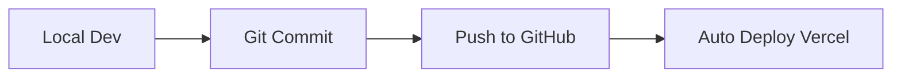

# KY Group Hub - Project Organization Guide

## 📋 Current Status & Cleanup Checklist

### ✅ Completed Cleanups
- [x] Removed backup files (`page-dynamic.tsx.bak`)
- [x] Created development documentation
- [x] Analyzed file structure

### 🗂️ Recommended File Organization

#### Current Structure (Good ✅)
```
kygroup-hub/
├── app/                     # Next.js pages (well organized)
├── components/             # Reusable components (clean)
├── lib/                    # Utilities (appropriate)
├── hooks/                  # Custom hooks (good practice)
├── public/                 # Static assets (standard)
└── styles/                 # Global styles (minimal)
```

#### Areas for Improvement 🔄

1. **Environment Configuration**
   ```
   📁 config/
   ├── database.ts         # DB configurations
   ├── auth.ts             # Auth settings
   └── constants.ts        # App constants
   ```

2. **Type Definitions**
   ```
   📁 types/
   ├── api.ts              # API response types
   ├── user.ts             # User/family types
   └── index.ts            # Exported types
   ```

3. **Utilities Organization**
   ```
   📁 lib/
   ├── api/                # API utilities
   ├── auth/               # Authentication helpers
   ├── validation/         # Form validators
   └── utils.ts            # General utilities
   ```

## 🚀 Workflow Recommendations

### Development Workflow


### Branch Strategy
- `master` - Production (auto-deploys)
- `develop` - Staging/testing
- `feature/*` - New features
- `fix/*` - Bug fixes

### Code Quality Tools to Add
```bash
# Install development tools
pnpm add -D eslint prettier husky lint-staged

# Pre-commit hooks
npx husky install
npx husky add .husky/pre-commit "pnpm lint-staged"
```

## 🎛️ Dashboard & Authentication Setup

### Recommended Dashboard Structure
```typescript
// Dashboard layout structure
app/
├── dashboard/
│   ├── layout.tsx          # Dashboard shell
│   ├── page.tsx            # Dashboard home
│   ├── analytics/          # Usage stats
│   ├── settings/           # User preferences
│   └── admin/              # Admin tools
```

### Authentication Options

#### Option 1: NextAuth.js (Recommended)
```bash
pnpm add next-auth
```
- Supports multiple providers
- Built for Next.js
- Session management
- Secure by default

#### Option 2: Clerk (Easiest)
```bash
pnpm add @clerk/nextjs
```
- Pre-built UI components
- User management dashboard
- Social login providers

#### Option 3: Custom Yandex OAuth (Current)
- Already partially implemented
- Full control over flow
- Needs completion

### Database Integration Options

#### Option 1: Supabase (Recommended)
```bash
pnpm add @supabase/supabase-js
```
- PostgreSQL database
- Real-time subscriptions  
- Built-in auth
- Free tier available

#### Option 2: PlanetScale
```bash
pnpm add @planetscale/database
```
- MySQL-compatible
- Serverless
- Branching for schema changes

#### Option 3: Continue with Yandex Disk
- File-based storage
- No additional costs
- Limited query capabilities

## 🔐 Security Checklist

### Environment Variables
```bash
# .env.local (never commit)
NEXTAUTH_URL=http://localhost:3000
NEXTAUTH_SECRET=your-secret-key
YANDEX_CLIENT_ID=your-client-id
YANDEX_CLIENT_SECRET=your-secret
DATABASE_URL=your-db-url
```

### Security Headers (add to next.config.mjs)
```javascript
const securityHeaders = [
  {
    key: 'X-DNS-Prefetch-Control',
    value: 'on'
  },
  {
    key: 'Strict-Transport-Security',
    value: 'max-age=63072000; includeSubDomains; preload'
  },
  // ... more headers
]
```

## 📊 Performance Monitoring

### Tools to Add
1. **Vercel Analytics** - Built-in performance metrics
2. **Sentry** - Error tracking
3. **Posthog** - User analytics
4. **Lighthouse CI** - Performance audits

## 🎯 Next Steps Priority

1. **High Priority**
   - [ ] Set up authentication system
   - [ ] Create user dashboard
   - [ ] Add error boundaries
   - [ ] Set up monitoring

2. **Medium Priority**  
   - [ ] Add database integration
   - [ ] Implement user roles
   - [ ] Add file versioning
   - [ ] Create admin panel

3. **Low Priority**
   - [ ] Add testing suite
   - [ ] Set up CI/CD pipeline
   - [ ] Add PWA features
   - [ ] Implement caching strategy

## 🔧 Maintenance Schedule

### Daily
- Monitor error logs
- Check deployment status
- Review user feedback

### Weekly  
- Update dependencies
- Review performance metrics
- Backup critical data

### Monthly
- Security audit
- Performance optimization
- Feature planning
- Documentation updates